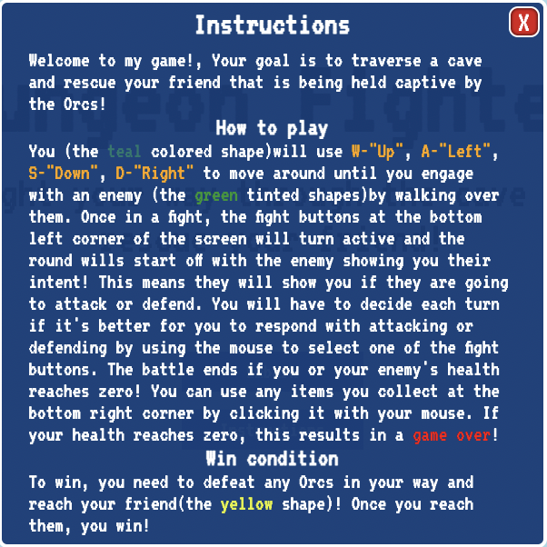
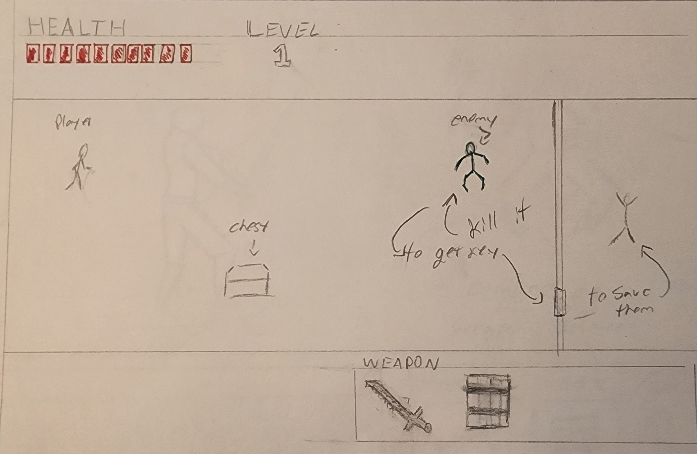
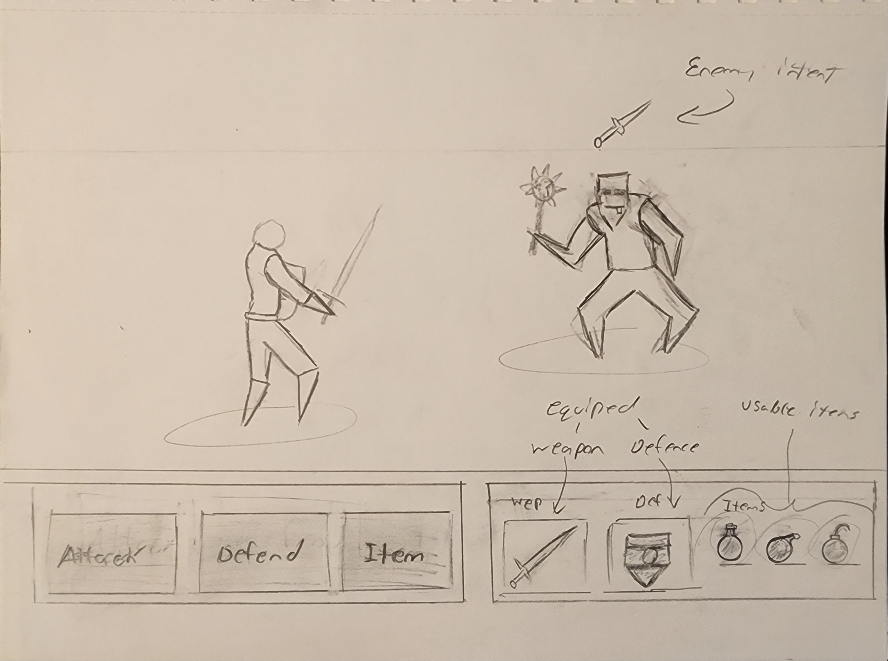
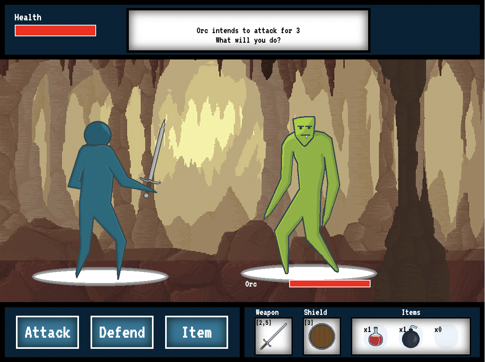
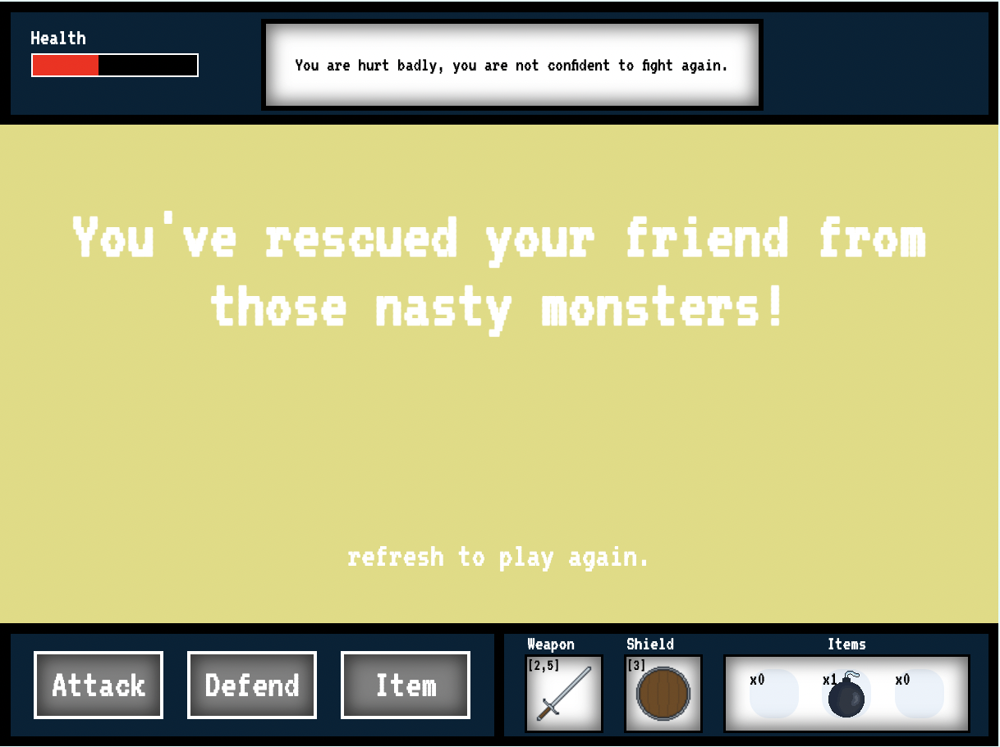

# Dungeon Fighter:

# Premise:

This game is about a hero tavling through a dungeon to defeat the dastardly orcs keeping your friend prisioner! 

<!-- add reference links here to all sections-->
---
## User Story  
As a user I want to
1. See a start screen that will allow "Embark" into the dungeon or click on "Instructions" to learn how to play.
2. Be able to transition from the start screen to the main game screen.
3. See the player model / enemy models / and interactables load up.
4. When the game begins, load basic music loop.
5. Move the character around useing "w,a,s,d" keys.
6. If the palyer collides with a lootable object the chest will change to an opened image, a sound will play, and the player will get a loot item.
7. When the player collides with the enemy initiate a fight.
8. Allow attack / defend for player and enemy to interect correctly and track.
9. On the players turn a message will display what the enemies intent is.
10. The player will be able to use a health potion from their inventory to heal during or after battle.
11. If player loses all of their health, bring up lose screen. 
12. If enemy loses all of their health transition back to the movestate on the main game screen. 
13. If the player reaches the prisoner the screen will transition to the win screen.
---
## Technologies Used:
* HTML
* CSS
* JavaScript (logic and DOM manipulation)
* Canvas

## Wireframes:

### Start screen

### instructions

### Main gameplay screen

### Fight screen

### Win screen

### Lose screen

## Knows BUGS:
* Sometimes when moving at full velocity it's possible to get past enemies without engaging. (speedrun strat?)

## Future Plans:
* more areas / world generation
    * I want to make it so the player can move from area to area with screen transitions.  
    * Different terrain and enemies.
* Enemies randomly generate on the level.
* multiple prisoners
* Lootable objects  
  * I want to make the lootable objects search through an array and give the player a random item / weapon to add diversity to the gameplay.
* The player will be able to swap out their equiped weapon / defence item to ones with different stats.
* Add indicators above the inventory items to show quantities.
* Add animations for message box on top of screen.